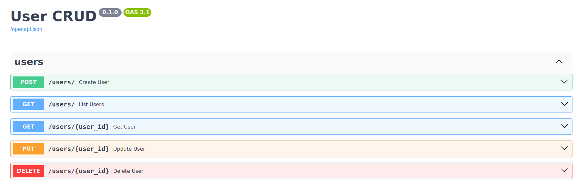
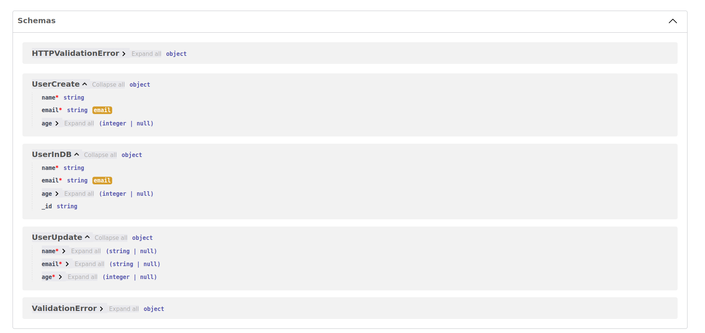

# User CRUD

A simple FastAPI project for managing users in MongoDB with basic CRUD operations.

## APIs

<!-- Add image -->


## Schemas




## Setup

1. Clone and navite to directory

2. **Create and activate a virtual environment:**

    ```bash
    python -m venv venv
    source venv/bin/activate  # For Windows: venv\Scripts\activate
    ```

3. **Install dependencies:**

    ```bash
    pip install -r requirements.txt
    pip install -r requirements-dev.txt  # For testing and linting
    ```

4. **Set environment variables:**

    ```bash
    export MONGO_URI="your uri"
    export DATABASE_NAME="usersdb"
    ```

## Running the App

Start the server with:

```bash
uvicorn app.main:app --reload
```

## Running the tests

Run the tests with:

```bash
pytest
```

## Linting

Lint the code with:

```bash
pre-commit run --all-files
```

